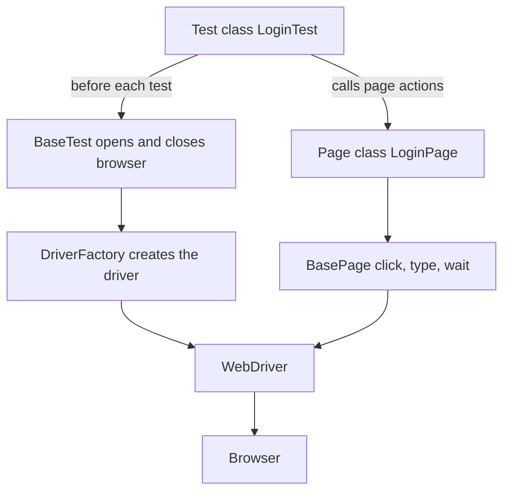
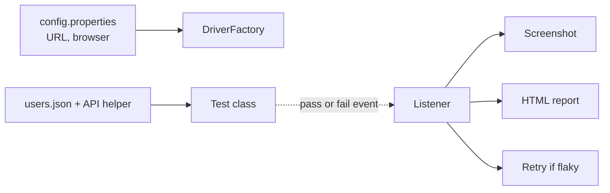

# SDET Prep — Selenium Project Structure

What a standard Selenium (Java + Maven + TestNG) automation project looks like, folder by folder, and how to walk someone through it in an interview.

**Written for:** ~3 years experience, mostly Selenium web automation.

---

## 1. Say this out loud

If asked "walk me through how your framework is organised", this is the 60-second version:

The project splits into two halves, and that split is the important part.

`src/main/java` holds the framework — the reusable code. Page classes, base classes, the driver factory, utilities, config reading, test data helpers, listeners. None of it is a test.

`src/test/java` holds only the tests — the actual test cases and their assertions.

That separation is what makes it a framework instead of a pile of scripts. A new person can write a test without touching framework code, and I can refactor the framework without rewriting tests.

Inside the framework, the layers are: a driver factory that creates the browser session, base classes for shared setup and shared UI actions, page classes that hold locators and page actions, utilities for waits and screenshots and data reading, and listeners that hook into pass/fail events for reporting and retries.

Config and test data live in `resources` as properties and JSON files, never hard-coded, so the same suite runs against any environment.

The one line to land: **"Tests describe intent. The framework knows how."**

---

## 2. The project tree

```text
selenium-automation-framework/
│
├── pom.xml                          Maven: dependencies + build config
├── testng.xml                       Default suite: which tests run
├── README.md                        How to run it
├── .gitignore
│
├── src/
│   ├── main/                        ===== THE FRAMEWORK (reusable) =====
│   │   ├── java/com/company/automation/
│   │   │   │
│   │   │   ├── base/
│   │   │   │   ├── DriverFactory.java      Creates + holds the WebDriver
│   │   │   │   ├── BaseTest.java           Opens/closes browser per test
│   │   │   │   └── BasePage.java           Shared UI actions: click, type, wait
│   │   │   │
│   │   │   ├── pages/
│   │   │   │   ├── LoginPage.java          Locators + actions for one page
│   │   │   │   ├── HomePage.java
│   │   │   │   ├── CheckoutPage.java
│   │   │   │   └── components/             Reusable pieces used on many pages
│   │   │   │       ├── HeaderComponent.java
│   │   │   │       └── CartWidget.java
│   │   │   │
│   │   │   ├── config/
│   │   │   │   ├── ConfigReader.java       Reads config.properties
│   │   │   │   └── Environment.java        dev / staging / prod switching
│   │   │   │
│   │   │   ├── utils/
│   │   │   │   ├── WaitUtils.java          Explicit wait helpers
│   │   │   │   ├── ScreenshotUtil.java     Capture on failure
│   │   │   │   ├── JsonReader.java         Read test data files
│   │   │   │   └── ExcelReader.java
│   │   │   │
│   │   │   ├── api/
│   │   │   │   ├── ApiClient.java          HTTP calls
│   │   │   │   └── UserApiHelper.java      Create test data via API, not UI
│   │   │   │
│   │   │   ├── data/
│   │   │   │   ├── UserFactory.java        Builds test data objects
│   │   │   │   └── TestDataBuilder.java
│   │   │   │
│   │   │   ├── listeners/
│   │   │   │   ├── TestListener.java       Hooks into pass/fail events
│   │   │   │   ├── RetryAnalyzer.java      Retry policy for flaky tests
│   │   │   │   └── ExtentReportListener.java
│   │   │   │
│   │   │   └── constants/
│   │   │       └── AppConstants.java       Timeouts, fixed values
│   │   │
│   │   └── resources/
│   │       ├── config.properties           URL, browser, timeouts
│   │       ├── log4j2.xml                  Logging setup
│   │       └── extent.properties           Report setup
│   │
│   └── test/                        ===== THE TESTS ONLY =====
│       ├── java/com/company/automation/tests/
│       │   ├── login/LoginTest.java
│       │   ├── checkout/CheckoutTest.java
│       │   └── smoke/SmokeTest.java
│       │
│       └── resources/
│           ├── testdata/
│           │   ├── users.json
│           │   └── products.xlsx
│           └── suites/
│               ├── smoke.xml               Fast set, runs on every PR
│               └── regression.xml          Full set, runs nightly
│
├── reports/                         Generated: HTML report
│   └── screenshots/                 Generated: failure screenshots
├── logs/                            Generated: run logs
├── target/                          Generated: compiled output
│
└── .github/workflows/
    └── regression.yml               CI pipeline
```

---

## 3. What each folder is for

| Folder | What lives here | Why it's separate |
| --- | --- | --- |
| `base/` | Driver factory, BaseTest, BasePage | Setup and shared behaviour in one place, so no test repeats it |
| `pages/` | One class per page: its locators and its actions | When the UI changes, you edit one file instead of many tests |
| `pages/components/` | Reusable widgets — header, nav, cart, modal | A widget appearing on 20 pages shouldn't be written 20 times |
| `config/` | Reads settings from properties files | The same suite runs on any environment without code changes |
| `utils/` | Waits, screenshots, file readers, date helpers | Small helpers that many classes need |
| `api/` | HTTP helpers for test setup | Create a user through an API instead of clicking a signup form — faster and far less flaky |
| `data/` | Builders/factories for test data objects | Each test gets fresh data, so tests don't collide |
| `listeners/` | Hooks that fire on test start, pass and fail | Screenshots, logging, reports and retries happen automatically, not per-test |
| `constants/` | Fixed values and timeouts | No magic numbers scattered through the code |
| `resources/` | Properties, JSON, XML | Data and config are not code |
| `test/java/` | The test cases and their assertions | The only place a test lives |
| `suites/` | XML files grouping tests | Lets CI run a fast set on a PR and the full set overnight |

---

## 4. How the pieces talk to each other at run time



Supporting pieces feeding in from the side:



### The chain in words

1. TestNG starts a test. `BaseTest` runs first and asks `DriverFactory` for a browser.
2. `DriverFactory` reads `config.properties` to know which browser and which URL.
3. The test calls page actions like `loginPage.loginAs(user)`.
4. The page class uses `BasePage` helpers for the actual clicking and waiting.
5. `BasePage` talks to WebDriver, which drives the browser.
6. The test asserts the result.
7. A listener catches the outcome — on failure it takes a screenshot and writes to the report.
8. `BaseTest` closes the browser.

---

## 5. The rules that make this a framework, not scripts

These are the points that get you credit. Each one is a real mistake you've probably seen.

1. **Assertions go in the test, never in the page class.** A page class describes what the page can do. The test decides what should be true. Mixing them means the page class can only be used one way.
2. **Locators go in the page class, never in the test.** If a test file contains a CSS selector, that's a bug waiting to happen.
3. **Page actions return something useful.** A `login()` method returning `HomePage` lets tests read like a journey.
4. **No hard-coded URLs, credentials or timeouts.** They belong in `config.properties`.
5. **Set up test data through APIs, not the UI.** Clicking through a signup form to test checkout is slow and gives you a second thing that can break.
6. **Every test cleans up after itself.** No test should depend on another test running first.
7. **`utils/` must not become a junk drawer.** If a class is called `Helper` or `CommonUtils` and is 800 lines long, it needs splitting.
8. **The driver must be thread-safe for parallel runs.** Hold it in a `ThreadLocal<WebDriver>` inside `DriverFactory`, so each thread gets its own browser. A plain static `WebDriver` field works fine until you turn on parallel execution, then everything breaks in confusing ways.

---

## 6. Sample test code — setup, teardown, page class, test

Illustrative Java + TestNG. Written to show the shape, not to compile.

### The driver holder

```java
public class DriverFactory {
    private static ThreadLocal<WebDriver> driver = new ThreadLocal<>();

    public static void createDriver(String browser) {
        WebDriver d = browser.equals("firefox")
                ? new FirefoxDriver()
                : new ChromeDriver();
        // deliberately 0 - never mix implicit and explicit waits
        d.manage().timeouts().implicitlyWait(Duration.ofSeconds(0));
        d.manage().window().maximize();
        driver.set(d);
    }

    public static WebDriver getDriver() {
        return driver.get();
    }

    public static void quitDriver() {
        if (driver.get() != null) {
            driver.get().quit();
            driver.remove();          // important, or threads leak
        }
    }
}
```

### Setup and teardown

```java
public class BaseTest {
    @BeforeMethod
    public void setUp() {
        DriverFactory.createDriver(ConfigReader.get("browser"));
        getDriver().get(ConfigReader.get("baseUrl"));
    }

    @AfterMethod
    public void tearDown(ITestResult result) {
        if (result.getStatus() == ITestResult.FAILURE) {
            ScreenshotUtil.capture(getDriver(), result.getName());
        }
        DriverFactory.quitDriver();
    }
}
```

### Shared page actions

```java
public class BasePage {
    protected WebDriver driver;
    protected WebDriverWait wait;

    public BasePage(WebDriver driver) {
        this.driver = driver;
        this.wait = new WebDriverWait(driver, Duration.ofSeconds(10));
    }

    protected void click(By locator) {
        wait.until(ExpectedConditions.elementToBeClickable(locator)).click();
    }

    protected void type(By locator, String text) {
        WebElement el = wait.until(ExpectedConditions.visibilityOfElementLocated(locator));
        el.clear();
        el.sendKeys(text);
    }

    protected String readText(By locator) {
        return wait.until(ExpectedConditions.visibilityOfElementLocated(locator)).getText();
    }
}
```

### A page class — locators and actions, no assertions

```java
public class LoginPage extends BasePage {
    private final By username    = By.cssSelector("[data-test='username']");
    private final By password    = By.cssSelector("[data-test='password']");
    private final By loginButton = By.cssSelector("[data-test='login-submit']");
    private final By errorBanner = By.cssSelector("[data-test='login-error']");

    public LoginPage(WebDriver driver) {
        super(driver);
    }

    // success path - hands you the next page
    public HomePage loginAs(User user) {
        type(username, user.getUsername());
        type(password, user.getPassword());
        click(loginButton);
        return new HomePage(driver);
    }

    // failure path - you stay here
    public LoginPage loginExpectingFailure(User user) {
        type(username, user.getUsername());
        type(password, user.getPassword());
        click(loginButton);
        return this;
    }

    public String errorMessage() {
        return readText(errorBanner);
    }
}
```

### The tests

```java
public class LoginTest extends BaseTest {
    @Test(groups = {"smoke"})
    public void validUserCanLogIn() {
        User user = UserApiHelper.createActiveUser();   // data via API, not the UI
        HomePage home = new LoginPage(getDriver()).loginAs(user);
        assertThat(home.isLoaded()).isTrue();
        assertThat(home.welcomeText()).contains(user.getFirstName());
    }

    @Test(groups = {"regression"})
    public void wrongPasswordShowsError() {
        User user = UserApiHelper.createActiveUser();
        LoginPage page = new LoginPage(getDriver())
                .loginExpectingFailure(user.withPassword("definitely-wrong"));
        assertThat(page.errorMessage())
                .isEqualTo("Username or password is incorrect");
    }
}
```

### Five things to point out about this code

Being able to narrate why it's written this way is the whole point.

1. **No assertions in `LoginPage`.** It exposes actions and reads state. The test decides what's correct.
2. **No locators in `LoginTest`.** If the login button's selector changes, one file changes.
3. **Page actions return the next page.** `loginAs()` returns `HomePage`, so the test reads like a user journey.
4. **`implicitlyWait` is set to 0 on purpose.** Mixing implicit and explicit waits causes unpredictable timeouts. Say this out loud in an interview — it's a detail only people who've been burned know.
5. **Test data comes from an API helper, not by filling in a signup form.**

---

## 7. How I handle flaky tests

### The principle to lead with

A retry that passes is not a pass. It's an unfixed problem with the cost hidden.

Retries are a shield while you fix something, never the fix itself. Say that first — most candidates jump straight to "I add a retry", which is the wrong instinct.

### The order I work in

1. **Make it visible.** You can't fix what nobody counts. Record every test that failed then passed without a code change. Without this, flakiness is just a vague complaint.
2. **Find the cause by category.** Almost all flakiness falls into a handful of buckets (below).
3. **Fix the cause, not the symptom.**
4. **Quarantine anything you can't fix today** — move it out of the blocking suite, but keep running it.
5. **Put a number on it.** Flake rate as a tracked metric, with a target.

### The usual causes, and how to spot each

| Cause | How you spot it | The fix |
| --- | --- | --- |
| Bad waiting | Passes locally, fails on slower CI | Explicit waits on a condition. Never `Thread.sleep`. Never mix implicit and explicit waits. |
| Shared test data | Fails only when tests run in parallel | Create fresh, unique data per test via API |
| Test order dependency | Passes alone, fails in the full suite | Each test sets up its own state. Run tests in random order to expose these. |
| Leftover state | First run passes, second run fails | Proper teardown, or new data every run |
| Animations and overlays | Clicks intermittently miss or hit the wrong thing | Wait for clickable and stable, not just present |
| Fragile locators | Breaks after every release | Stable `data-test` attributes |
| Background jobs / async | Assertion runs before the work finishes | Poll the API for the real state instead of sleeping |
| Environment or third party | Many unrelated tests fail together | Mock third parties. Separate "infrastructure broke" from "test failed". |

Being able to say "tell me the failure pattern and I'll tell you the likely category" is a strong answer.

### The quarantine process

1. A test fails, then passes with no code change → it's flagged as flaky.
2. Move it into a quarantine suite. It still runs, but it doesn't block the pipeline.
3. Raise a ticket with a named owner and a deadline.
4. Triage the quarantine list weekly.
5. Cap the list and time-limit it. Otherwise quarantine becomes a graveyard, and you've just hidden the problem more neatly.

### The metric

Flake rate = tests that passed only after a retry ÷ total test runs.

A common target is under 1%. The reason it matters is trust: once people expect the suite to be partly red, they re-run instead of investigating, and the suite stops being a gate.

One line to close on:

**"Retries buy time. They don't buy quality. The goal is that when the suite is red, people believe it."**

---

## 8. My stand on locator strategy

### The priority order

Work down this list. Use the first one available.

| Priority | Locator type | Why |
| --- | --- | --- |
| 1 | Dedicated test attributes — `data-test`, `data-testid` | They're a contract. Developers know not to change them. Nothing else is this stable. |
| 2 | Role and accessible name / label text | Tests what a user actually perceives, and doubles as a light accessibility check |
| 3 | A genuinely stable, unique id | Fast and clean — but check it isn't auto-generated and different on each render |
| 4 | CSS on meaningful, stable attributes | Readable and fast |
| 5 | Visible text | Good for intent, but breaks on copy changes and translations |
| 6 | Relative XPath | Only when you need something CSS can't do |
| Never | Absolute XPath, index positions, generated class names | Break the moment anyone touches the markup |

### CSS or XPath?

CSS is faster to run and easier to read, so it's the default. XPath has only two real advantages:

1. It can go upward in the page structure (find a parent from a child).
2. It can match on text content.

If you don't need either, use CSS. Saying it that plainly shows you've made the decision deliberately rather than picked a side.

### The actual senior point

The most important thing isn't the syntax. It's whether you have an agreement with developers.

> "The real fix for fragile locators isn't a cleverer selector. It's asking developers to add test attributes, and getting that into the definition of done. I'd rather fix the source than keep repairing the locator."

That reframes the question from a technical preference into a team problem — which is what's actually being assessed.

### How I'd decide on a new project

1. Look at what the app already offers — are there test IDs? Stable IDs? Good labels?
2. Write the priority order into the framework's standard, so it's not per-person taste.
3. Enforce it in code review on test pull requests.
4. Where the app gives me nothing, raise it with developers with evidence — "these N tests broke last release because of missing test IDs."
5. Keep every locator in the page class, never in a test.

### The rule of thumb

> "If a locator breaks because someone changed styling or moved a div, it was the wrong locator."

---

## 9. Challenges with the wider team, and what I fixed

**IMPORTANT — only use items you actually did.** This is the question most likely to be probed with "walk me through exactly how." Pick 2 or 3 that are genuinely yours, fill in the real numbers, and drop the rest.

Structure every one as: **problem → what I did → result**.

| Problem | What I did | Result (put your real number in) |
| --- | --- | --- |
| Tests broke every release because the app had no test IDs | Agreed a `data-test` naming convention with developers and got it added to the definition of done | Locator-related failures dropped from [N] per release to [N] |
| Everyone wrote their own waits, including `Thread.sleep` | Centralised wait helpers in BasePage and flagged sleep in code review | Suite runtime down from [N] to [N] minutes |
| Tests set up data by clicking through the UI | Built API helpers for setup, so tests start at the page under test | Runtime and flakiness both dropped; one failing signup form stopped breaking [N] unrelated tests |
| Everyone shared the same test login | Built a data factory creating a fresh user per test | Made parallel runs possible at all |
| The suite was always partly red, so nobody trusted it | Added flake tracking and a quarantine suite, so a red pipeline meant something real | People started investigating failures instead of re-running |
| Developers never ran the tests — only QA did | Split out a fast smoke suite on every pull request | Developers got their own feedback in [N] minutes, so bugs were caught before QA |
| A CI failure was impossible to debug from logs alone | Added screenshot plus HTML report on failure, attached to the CI run | Debugging a failure went from [N] to [N] minutes |
| Everyone structured tests differently, so code was duplicated | Wrote a short framework guide and started reviewing test pull requests | New joiners could add a test without asking how |

### The part that's really being tested

"Challenges with the wider team" is a question about influence without authority. Three things worth saying:

1. **Developers saw tests as QA's problem.** What changed it was framing the suite as their feedback loop, not my report. Fast tests on their pull request made it their tool.
2. **Getting test IDs added needed evidence, not requests.** Asking as a favour didn't work. Showing that [N] tests broke last release because of missing hooks did.
3. **Saying "not ready" needs data.** An opinion gets overruled. "These [N] cases fail and here's the risk" doesn't.

---

## 10. "How many test cases could you write in a day?"

Your instinct — 1 to 2 a day — is a fine, honest answer. What matters is the framing around it. Don't give a bare number, and don't inflate it: claiming 8–10 a day invites "so they must be shallow", and it's easy to expose.

### The answer to give

It depends a lot on whether the groundwork already exists, so let me split it.

If it's a brand new page, the first test takes me a day or more — but most of that isn't the test. It's building the page class, working out stable locators, and setting up the test data path. The test itself is the last twenty minutes.

Once that page class and the data helpers exist, I can comfortably add 3 to 5 tests a day on the same area, more if they're data-driven variants of the same flow.

Across a normal mix of new areas and existing ones, that averages out to about **1 to 2 solid, reviewed, non-flaky tests a day**. And I'd say "reviewed and non-flaky" deliberately — a test I merged that starts failing randomly next week wasn't finished.

### Then reframe it — this is the senior part

I'd gently push back on the metric though. Test count isn't a great measure of progress. Ten shallow UI tests can be worth less than one good API-level test, and adding tests to an already flaky suite makes things worse, not better. I'd rather be measured on whether the suite catches real problems and how fast it gives feedback.

### Why this answer works

- It's honest, so nothing collapses under follow-up questions.
- It shows you know where the time actually goes — groundwork, not typing tests.
- It defines "done" as reviewed and stable, not merged.
- It questions the metric, which is exactly the behaviour that separates senior from mid-level.

---

## 11. Follow-ups & traps

| They ask | You say |
| --- | --- |
| "Why split main and test?" | "main is the framework — reusable code someone else can build tests on. test is only test cases. It means I can refactor the framework without touching tests, and a new joiner writes tests without needing to understand the plumbing." |
| "Where do assertions belong?" | "In the test. The page class exposes actions and returns state; the test decides what's correct. Putting assertions in page classes is the most common mistake — it locks the page class to one scenario." |
| "What's the difference between BaseTest and BasePage?" | "BaseTest handles lifecycle — open the browser, close it, attach listeners. BasePage handles shared UI behaviour — click, type, wait for visible. One is about the test run, the other is about the page." |
| "How do you handle parallel runs?" | "`ThreadLocal<WebDriver>` in the driver factory, so each thread has its own browser and its own data. Tests must not share state — that's the real constraint, not the thread config." |
| "Where does test data come from?" | "JSON or Excel in test/resources for static data, and API helpers for anything that needs creating. I avoid setting up state through the UI." |
| "How do you run only smoke tests?" | "TestNG groups plus separate suite XMLs. CI runs `smoke.xml` on every PR and `regression.xml` nightly." |
| "What would you improve in this structure?" | Good answer to have ready: "The utils package always drifts into a junk drawer, so I'd keep splitting it. And I'd push more setup into API helpers over time — that's usually the fastest way to cut both runtime and flakiness." |
| **Trap:** describing folders only | Don't just list folders. Explain why each is separate. The reasoning is what's being assessed. |
| **Trap:** saying "Page Object Model" and stopping | Everyone says it. Add what it actually buys you: one place to change when the UI changes. |
| "A test is flaky. What's the first thing you do?" | "Not add a retry. First I check whether it failed then passed with no code change, and I look at the pattern — parallel only, suite only, or slow CI only. The pattern tells me the category, and the category tells me the fix." |
| "Isn't a retry good enough?" | "As a temporary shield, yes. As the fix, no — a retry that passes isn't a pass, it just hides the cost. And once people expect red, they re-run instead of investigating, and the suite stops being a gate." |
| "CSS or XPath?" | "CSS by default — faster and more readable. XPath only when I need to go up to a parent or match on text, which are the two things CSS can't do." |
| "What if the app has no test IDs?" | "Then I fall back to roles and labels, but I also raise it with developers using evidence — how many tests broke last release for that reason. The real fix is the source, not a cleverer selector." |
| **Trap:** giving a flat number of tests per day | Split it: first test on a new page takes a day because of the groundwork; 3–5 a day once the page class exists. Then question the metric. |

### Words to use comfortably

Page Object Model · page component · base class · driver factory · `ThreadLocal` · listener · retry analyzer · TestNG suite · groups · properties file · test data factory · fixture · flake rate · quarantine suite · explicit vs implicit wait · `data-test` attribute · definition of done · POM (Maven `pom.xml`) — note this is a different POM from Page Object Model, be clear which you mean.
